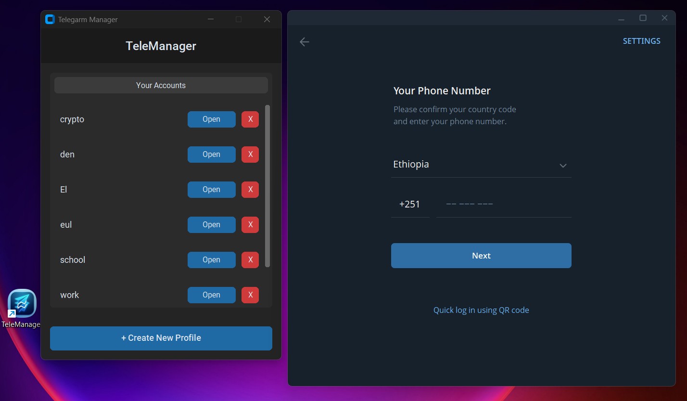

# 📱 TeleManager - How to run more than 3 accounts on Telegram Desktop

[](https://www.python.org/)
[](https://opensource.org/licenses/MIT)
[](https://github.com/TomSchimansky/CustomTkinter)
[](https://www.microsoft.com/windows)

**TeleManager** is a lightweight, high-performance Windows application designed to manage and launch **unlimited** Telegram accounts simultaneously. 

By leveraging isolated "Portable Profiles," TeleManager ensures every account operates within its own sandbox—preventing data conflicts and bypassing the official app's account limit for most users (commonly 3 accounts; Telegram Premium users may have higher account capability).

---

## 📸 Interface

<p align="center">
  
</p>

---

## 🚀 Key Features

-   **♾️ Unlimited Accounts:** No more account switching. Add as many profiles as your hardware can handle (Work, Personal, Crypto, Automation).
-   **⚡ Simultaneous Instances:** Run multiple independent Telegram windows at the exact same time.
-   **🛡️ Sandboxed Security:** Each profile maintains its own `tdata` folder. Your sessions, settings, and caches are never mixed.
-   **🎨 Modern UI:** A native-feeling Windows 11 interface built with `CustomTkinter`, featuring full Dark Mode support.
-   **📦 Portable Core:** Uses the official, unmodified Telegram Portable executable for maximum security and reliability.

---

## 📥 Installation

### 1. For Regular Users (Recommended)
1. Navigate to the **[Releases](https://github.com/telemanager-app/telemanager/releases)** page.
2. Download the latest **`TeleManager_Setup.exe`**.
3. Follow the installation wizard. The official Telegram client is bundled for your convenience.

### 2. For Developers & Building

#### 💻 Run from Source
To customize or contribute to TeleManager:

1.  **Clone the repository**

    ```bash
    git clone https://github.com/telemanager-app/telemanager.git
    cd telemanager
    ```

2.  **Install dependencies**

    ```bash
    pip install customtkinter pillow
    ```

3.  **Add Telegram binary**

    -   Download the **Telegram Portable** version from [desktop.telegram.org](https://desktop.telegram.org).
    -   Create a folder named `bin` in the project root.
    -   Place `Telegram.exe` inside the `/bin/` folder.

4.  **Launch**

    ```bash
    python main.py
    ```

#### 📦 Building the Installer (Inno Setup)

If you want to create the final `TeleManager_Setup.exe` installer yourself, follow these steps.

1.  **Build the Python executable**

    First, compile the Python code into an `.exe` with the icon:

    ```bash
    pyinstaller --noconsole --onefile --icon=appicon.ico --name="TeleManager" main.py
    ```

2.  **Organize the build folder**

    Create a folder named `Release` and organize your files exactly like this:

    ```text
    Release/
    ├── TeleManager.exe     <-- (Move from dist/ folder)
    ├── app.ico             <-- (Copy your icon here)
    └── bin/
        └── Telegram.exe    <-- (The portable Telegram executable)
    ```

3.  **Compile with Inno Setup**

    1. Download and install [Inno Setup](https://jrsoftware.org/isinfo.php).
    2. Create a new file named `setup_script.iss`.
    3. Paste the script below.
    4. **IMPORTANT:** Change the Source paths (`C:\Path\To\Your\Release\...`) to match the location of the Release folder on your computer.
    5. Click **Build** (Play button).

    ```ini
    [Setup]
    ; --- Application Details ---
    AppName=TeleManager
    AppVersion=1.0
    AppPublisher=Eyuel Engida
    ; Install to user's AppData folder (Write permissions allowed!)
    DefaultDirName={userappdata}\TeleManager
    DefaultGroupName=TeleManager
    
    ; --- Permissions ---
    ; This allows the app to write to its own folder without Admin password
    PrivilegesRequired=lowest
    
    ; --- Icon Settings ---
    SetupIconFile=C:\Users\hp\Desktop\TM_Build\Release\appicon.ico
    UninstallDisplayIcon={app}\TeleManager.exe
    
    ; --- Output Settings ---
    Compression=lzma2
    SolidCompression=yes
    OutputDir=userdocs:../Desktop
    OutputBaseFilename=TeleManager_Setup
    WizardStyle=modern
    
    [Files]
    ; 1. YOUR APP
    Source: "C:\Users\hp\Desktop\TM_Build\Release\TeleManager.exe"; DestDir: "{app}"; Flags: ignoreversion

    ; 2. TELEGRAM PORTABLE
    Source: "C:\Users\hp\Desktop\TM_Build\Release\bin\Telegram.exe"; DestDir: "{app}\\bin"; Flags: ignoreversion

    ; 3. THE ICON (Renamed to appicon.ico)
    Source: "C:\Users\hp\Desktop\TM_Build\Release\appicon.ico"; DestDir: "{app}"; Flags: ignoreversion
    
    [Dirs]
    ; Create the empty profiles folder
    Name: "{app}\\profiles"
    
    [Icons]
    ; Desktop Shortcut
    Name: "{autodesktop}\\TeleManager"; Filename: "{app}\\TeleManager.exe"; IconFilename: "{app}\\appicon.ico"
    ; Start Menu Shortcut
    Name: "{group}\\TeleManager"; Filename: "{app}\\TeleManager.exe"; IconFilename: "{app}\\appicon.ico"
    
    [Run]
    ; Auto-run after install
    Filename: "{app}\\TeleManager.exe"; Description: "Launch TeleManager"; Flags: nowait postinstall skipifsilent
    ```

---

## 🛠️ Tech Stack

-   **Language:** [Python 3.10+](https://www.python.org/)
-   **GUI Framework:** [CustomTkinter](https://github.com/TomSchimansky/CustomTkinter) (Modern UI)
-   **Imaging:** [Pillow](https://python-pillow.org/) (Icon processing)
-   **Deployment:** [Inno Setup](https://jrsoftware.org/isinfo.php) (Windows Installer)

---

## ⚖️ Disclaimer

**TeleManager** is a launcher utility. It is **not** a modified or third-party Telegram client. It simply executes the official Telegram binary with specific command-line flags to enable multi-profile support. 

-   **Privacy:** All data is stored locally on your machine in the installation directory.
-   **Security:** We do not intercept, read, or transmit your Telegram data.

---

## 📄 License

This project is licensed under the **MIT License**. See the [LICENSE](LICENSE) file for details.

---

Created with by **[Eyuel Engida](https://github.com/Eul45)**
